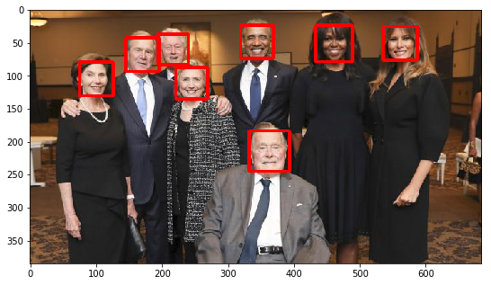
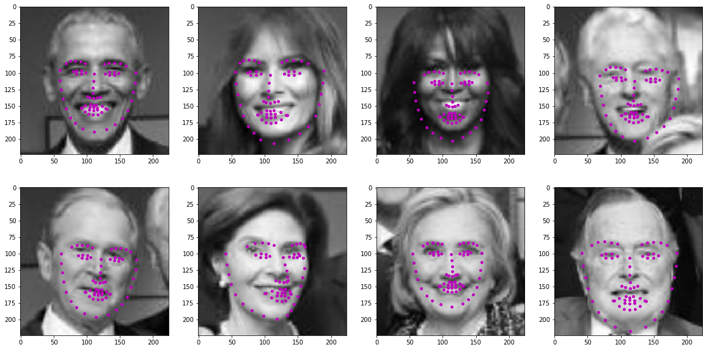

## OpenCV functions used:

imread, cvColor, rectangle, resize, CascadeClassifier(...).detectMultiScale(...)

## Method:

For face detection, the OpenCV function CascadeClassifier::detectMultiScale was used with an OpenCV XML file encoding a Haar Cascade classifier.

For keypoint detection, a CNN architecture was chosen, similar to that described in the [NaimishNet paper](1710.00977_NaimishNet.pdf). Three different variants of the architecture were tested, "full", "lite" and "superlite". The implementation of each model is found in the respective "model_xxx.py" file. A summary of the differences between the architectures, and other design decisions such as hyperparameter selection, are found in answers to three questions near the bottom of [this notebook](2.%20Define%20the%20Network%20Architecture-lite.ipynb). The networks were trained on a dataset of ~3500 images labeled with truth keypoints. The amount of training was limited further by time, given the available computation resources.

## Results:

[This notebook](3.%20Facial%20Keypoint%20Detection,%20Complete%20Pipeline-lite.ipynb) contains the full pipeline: face detection, extraction and preprocessing, and keypoint prediction, as well as the final results.

After face detection, with bounding boxes drawn around the detected faces:

After keypoint prediction, using the trained "naimishlite" model:

Placement of keypoints on some of the faces is suboptimal due to limited training time and data.
