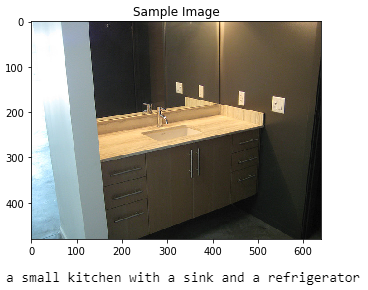

Project instructions are found in the [Udacity README](README_Udacity.md).

## Method:

[The Dataset notebook](0_Dataset.ipynb) initializes the [COCO API](https://github.com/cocodataset/cocoapi) (the "pycocotools" library) used to access data from the MS COCO (Common Objects in Context) dataset, which is "commonly used to train and benchmark object detection, segmentation, and captioning algorithms." The notebook also depicts the processing pipeline using the following diagram:

[The Preliminaries notebook](1_Preliminaries.ipynb) uses the pycocotools, torchvision transforms, and NLTK to preprocess the images and the captions for network training. It also explores the EncoderCNN, which is taken pretrained from [torchvision.models, the ResNet50 architecture](https://pytorch.org/docs/master/torchvision/models.html#id3).

The implementations of the EncoderCNN, which is supplied, and the DecoderRNN, which is left to the student, are found in the [model.py](model.py) file.

In [the Training notebook](2_Training.ipynb) one finds selection of hyperparameter values and EncoderRNN training. The hyperparameter selections are explained.

[The Inference notebook](3_Inference.ipynb) contains the testing of the trained networks to generate captions for additional images. No rigorous validation or accuracy measurement was performed, only sample images were generated. See below.

## Results:

Four sample images were captioned, two in which the caption matches well, 

  

...and two for which the caption doesn't match quite so well:

  

Steps for additional improvement would be exploring the optional validation task at the end of the training notebook, and also additional training.
